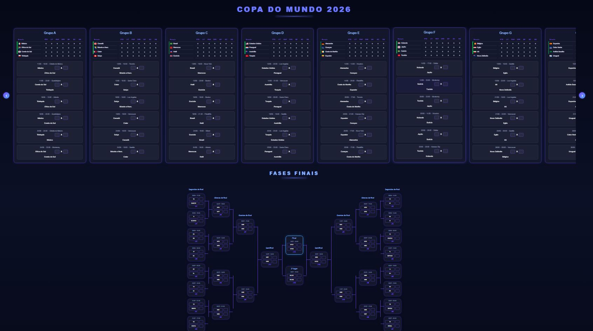

<p align="center">
  
</p>

<h1 align="center">🏆 Copa do Mundo 2026</h1>

<p align="center">
Sistema web completo para simulação e gerenciamento da Copa do Mundo FIFA 2026.
</p>

## 🌐 Acesso Online

**Aplicação:** https://caires-tech.github.io/copa-do-mundo-2026/

## 📸 Demonstração



---

## 🚀 Funcionalidades

### Fase de Grupos

* Cadastro dos resultados das partidas
* Atualização automática da classificação
* Cálculo de:

  * Pontos
  * Vitórias
  * Empates
  * Derrotas
  * Gols Pró
  * Gols Contra
  * Saldo de Gols
* Aplicação automática dos critérios de desempate
* Destaque visual para os classificados

### Melhores Terceiros Colocados

* Identificação automática dos 8 melhores terceiros
* Classificação baseada em:

  * Pontos
  * Saldo de gols
  * Gols marcados
* Destaque visual dos classificados
* Ajuste manual disponível para administradores

### Mata-Mata Completo

* Segunda fase (32 seleções)
* Oitavas de final
* Quartas de final
* Semifinais
* Disputa de 3º lugar
* Final

### Sistema de Avanço Automático

* Propagação automática dos vencedores para a próxima fase
* Atualização automática das chaves
* Destaque visual dos vencedores

### Disputa por Pênaltis

* Exibição automática dos campos de penalidades em caso de empate
* Definição automática do vencedor após os pênaltis

### Campeão

* Identificação automática do campeão
* Exibição da bandeira da seleção campeã
* Destaque visual na página principal

### Área Administrativa

* Login protegido por usuário e senha
* Controle de sessão utilizando Express Session
* Restrição de edição para usuários não autenticados
* Botões administrativos para gerenciamento do torneio

### 💾 Persistência de Dados

Os dados são armazenados no Supabase, utilizando uma tabela única (`app_data`) com estrutura baseada em chave/valor:

- scores → resultados da fase de grupos
- thirds → melhores terceiros colocados
- knockout → chaveamento da fase eliminatória
- tournament_state → estado geral do torneio

## 🔄 Evolução da Arquitetura

O projeto originalmente utilizava arquivos JSON locais para persistência de dados.

Posteriormente, foi migrado para o Supabase, garantindo:

- Persistência real em produção
- Dados independentes do servidor Render
- Melhor escalabilidade
- Consistência entre sessões e deploys

---

## 🛠 Tecnologias Utilizadas

### Frontend

* HTML5
* CSS3
* JavaScript (Vanilla JS)

### Backend

* Node.js
* Express.js
* Express Session
* CORS
* Supabase

### Armazenamento

* Supabase

### Hospedagem

* GitHub Pages (Frontend)
* Render (Backend)

---

## 📂 Estrutura do Projeto
⚠️ Os arquivos JSON foram substituídos por persistência via Supabase.
```text
copa-2026/
│
├── data/
│   └── groups.js
│
├── img/
│   ├── cup2026-transp.png
│   └── tela-pagina.jpg
│
├── index.html
├── admin.html
│
├── style.css
├── admin.css
│
├── script.js
├── admin.js
│
├── backend/
│   ├── server.js
│   ├── .env
│   ├── package.json
│   └── package-lock.json
│
└── README.md
```

---

## ⚙️ Como Executar o Projeto

### 1. Clonar o repositório

```bash
git clone https://github.com/caires-tech/copa-do-mundo-2026.git
```

### 2. Acessar a pasta

```bash
cd copa-do-mundo-2026
```

### 3. Instalar as dependências

```bash
npm install
```

### 4. Criar o arquivo .env

```env
ADMIN_USER=admin
ADMIN_PASSWORD=sua_senha
SUPABASE_URL=https://xxxx.supabase.co
SUPABASE_KEY=sua_chave_aqui
```

### 5. Iniciar o backend

```bash
node server.js
```

Servidor:

```text
http://localhost:3000
```

### 6. Executar o frontend

Abra o projeto utilizando a extensão Live Server do VS Code.

---

## 🔒 Segurança

O sistema utiliza:

* Sessões via Express Session
* Middleware de autenticação
* Controle de acesso administrativo
* Proteção de rotas sensíveis
* Restrição de edição para visitantes

---

## 🎯 Objetivo do Projeto

Este projeto foi criado como prática de desenvolvimento Full Stack, envolvendo conceitos como:

* Manipulação de DOM
* JavaScript avançado
* Regras de negócio complexas
* Estruturas de dados
* Backend com Node.js
* Autenticação e sessões
* Persistência de dados
* Integração Frontend ↔ Backend
* Deploy em produção
* Organização e documentação de código

Além do aprendizado técnico, o objetivo foi desenvolver uma aplicação completa simulando um torneio esportivo real, desde a fase de grupos até a definição do campeão mundial.

---

## 👨‍💻 Autor

Rodrigo Caires

Desenvolvedor Web Júnior em formação, com experiência profissional nas áreas administrativa e financeira e atualmente focado em Desenvolvimento Full Stack e Inteligência Artificial.

GitHub: https://github.com/caires-tech

LinkedIn: https://www.linkedin.com/in/rodrigo-caires

---

⭐ Se você gostou do projeto, considere deixar uma estrela no repositório. Sugestões e melhorias são sempre bem-vindas.
